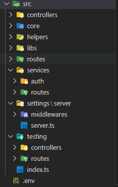

# Express Cli - For API

## Documentation

**Sapanish**:

**api-express-cli** es un mini framework para Node.js que se encuentra disponible como paquete npm. Con este framework, puedes crear un proyecto básico de API con gran facilidad y personalizarlo a tu gusto.

El framework te permite crear controladores, entidades y servicios de manera rápida y sencilla, mediante un comando. Además, puedes añadir diferentes tipos de módulos también con un comando, lo que te permite integrar funcionalidades como la conexión a bases de datos y el envío de correo por SMTP.

Uno de los puntos fuertes de **api-express-cli** es su fuerte tipado. Esto te permitirá trabajar con mayor comodidad y seguridad al programar tu API.

En definitiva, **api-express-cli** es una herramienta muy útil para aquellos que quieren crear APIs de manera rápida y sencilla, pero con la posibilidad de personalizarla a su gusto y con una gran variedad de funcionalidades integradas.

**English:**

**api-express-cli** is a mini framework for Node.js that is available as an npm package. With this framework, you can create a basic API project easily and customize it to your liking.

The framework allows you to quickly and easily create controllers, entities, and services using a command. In addition, you can add different types of modules with a command, which allows you to integrate functionalities such as database connection and SMTP email sending.

One of the strengths of **api-express-cli** is its strong typing. This will allow you to work more comfortably and safely when programming your API.

In short, **api-express-cli** is a very useful tool for those who want to create APIs quickly and easily, but with the possibility of customizing it to their liking and with a variety of integrated functionalities.

### Setting up a project

Install `api-express-cli` in dev dependecies:

```bash
npm i -g api-express-cli
```

Initialize project:

```bash
aec create <name-your-project>
```

> This will create a structure for the project,
> It has a basic http server to start working.
>
> The following image shows the structure created.
>
> 

**Note:** For the following command table, you can create multiple values such as routes, controllers, services, and entities that are separated by space. If you want you can create just by running the command without the value, and the system will help you step by step.

| Commands            |         Value         | Params | Example           | Description                                                      |
| :------------------ | :-------------------: | :----: | :---------------- | :--------------------------------------------------------------- |
| `aec create`      |    `<your-name>`    |        | `aec api-test`  | Create project name with given name                              |
| `aec route`       |  `<route1 route2>`  |        | `aec r users`   | Create a route with the given name                               |
| `aec controller ` |   `<ctrl1 ctrl2>`   |        | `aec c users`   | Create a controller with the given name                          |
| `aec r+c`         |  `<user employee>`  |        |                   | Create a route and controller with the given name.               |
| `aec service`     | `<auth send-mail>` |        | `aec s auth`    | Create a service with the given name                             |
| `npx aec entity`  | `<users employees>` |        | `aec e users`   | Create an entity with the given name: (controller, route, model) |
| `npx aec remove`  |   `db` or `ws `   |        | `npx aec rm db` | Removes one of the utilities that is added.                      |
| `npx aec --help`  |                      |        | `aec -h`       | Show command help                                                |

⚠️ **Warning:** Do not remove or edit source code comments.

## Quick start

> After initializing the project, to verify that everything went well, you have to execute the following commands:
>
> - Transpile code from ts to js.
>   > `npm run watch-ts`
>   >
> - Start server.
>   > `npm run dev:watch-server`
>   >

> You can then see if it is operating correctly by putting this `http://localhost:3000` in your browser.
