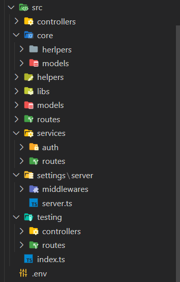

# Express Cli - For API

## Documentation

### Stting up a project

Install `api-express-cli` in dev dependecies:

```bash
npm i -D api-express-cli
```

Initialize typscript:

```
npx tsc --init
```

> Uncomment `outDir `in the generated `tsconfig.json `file and put `./dist.`
>
> Also look for `target `and put `ES2022`.

Install all types of dependency packagesInstall all types:

```
npm i -D @types/morgan @types/express @types/node
```

Install nodemon so that the server restarts, for each change:

```bash
npm i -D nodemon
```

Add the following scripts in package.json:

```json
"scirpts": {
"start":"node ./dist/index",
"watch-node": "nodemon ./dist/index",
"watch-ts": "npx tsc -w"
}
```

Initialize project:

> This will create a structure for the project focused on the MVC model,
> It has a basic http server to start working.
>
> The following image shows the structure created.
>
> 

```bash
npx aec init
```

Create a route:

```bash
npx aec route
```

Create a controller:

```bash
npx aec controller
```

Create a model:

```bash
npx aec model
```

Create a entity:

```
npx aec entity
```

See help:

```
npx aec --help
```

## Quick start

> After initializing the project, to verify that everything went well, you have to execute the following commands:
>
> - Transpile code from ts to js.
>   > `npm run watch-ts`
> - Start server.
>   > `npm run watch-node`

> You can then see if it is operating correctly by putting this `http://localhost:3000` in your browser.
